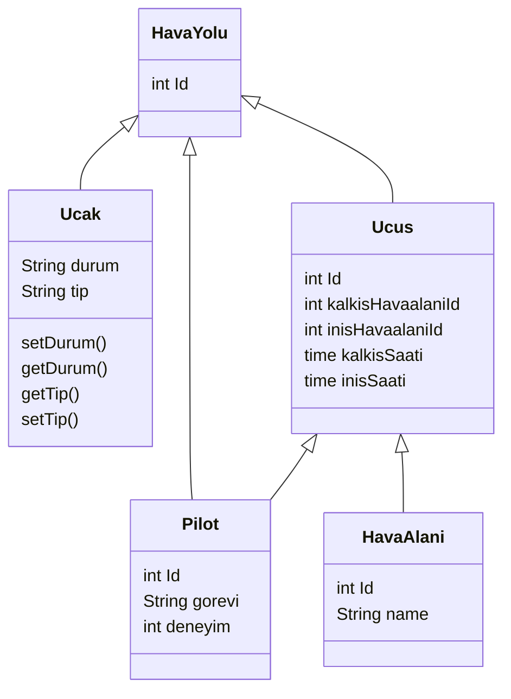

```mermaid
classDiagram
    HavaYolu <|-- Ucak
    HavaYolu <|-- Ucus
    Ucus <|-- Pilot
    Ucus <|-- HavaAlani
    HavaYolu <|-- Pilot
 
    
    
    class HavaYolu{
    int Id
       
    }
    class Ucak{
    String durum
    String tip
    setDurum()
    getDurum()
    getTip()
    setTip()
        
    }
    class Ucus{
    int Id
    int kalkisHavaalaniId
    int inisHavaalaniId
    time kalkisSaati
    time inisSaati
    }
    class HavaAlani{
    int Id
    String name
    }
    class Pilot{
    int Id
    String gorevi
    int deneyim
    }
```
